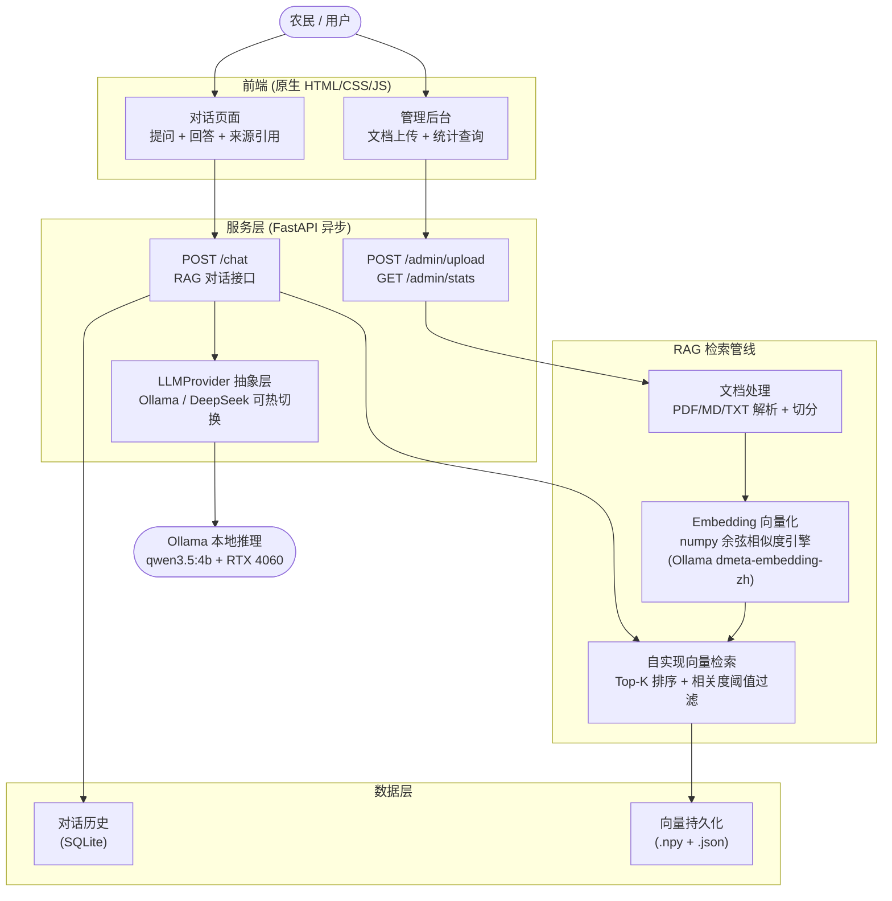

# 水稻种植智能问答系统 (Rice-QA-System)

> 🚧 **当前为 MVP 版本** | 四川农业大学 2026 年本科生科研兴趣培养计划立项项目

基于 RAG（检索增强生成）技术的水稻种植知识问答系统。农民输入自然语言问题，系统从专业知识库中语义检索相关内容，结合本地大语言模型生成准确、可追溯的种植建议。**完全离线运行，零外部 API 依赖。**

---

## 系统架构



**核心数据流**：
1. 问题向量化（dmeta-embedding-zh, 768 维）→ 余弦相似度检索 Top-K 文档片段
2. Prompt 组装（System Prompt + 检索知识 + 对话历史 + 用户问题）
3. LLM 生成回答 + 标注引用来源
4. 对话记录存入 SQLite，支持多轮上下文

## 技术亮点

### 自实现向量检索引擎
不使用 Chroma/FAISS，基于 numpy 从零实现余弦相似度计算 + Top-K 排序。向量以 `.npy` 格式持久化到本地磁盘，零 C 扩展依赖，完全跨平台。支持相关度阈值过滤（默认 0.35），避免无关知识污染 Prompt。

```python
# 核心检索逻辑（backend/rag/retriever.py）
similarities = np.dot(query_vec, vectors.T)  # 归一化后等价于余弦相似度
top_k_indices = np.argsort(similarities)[-self.top_k:][::-1]
```

### LLMProvider 抽象层
定义 `LLMProvider` 抽象基类，`OllamaProvider` 为当前实现。预留标准接口 `async generate(messages) -> str`，可无缝切换至 DeepSeek/OpenAI API。

### Prompt 工程
- 知识组装：将检索到的文档片段以结构化格式注入 System Prompt
- 多轮对话：保留最近 N 轮历史，控制上下文窗口
- 来源引用标注：每个回答附带检索来源，支持可追溯性
- 安全边界：明确拒绝农药配比、剂量建议等高风险问题

### 全离线部署
模型通过 Ollama 本地加载（qwen3.5:4b, ~2.4GB），RTX 4060 8G GPU 推理，无需联网，端到端延迟 < 60 秒。

## 快速启动

### 环境要求
- Python 3.10+
- Ollama（已安装并运行）
- RTX 4060 或等效 GPU（CPU 推理也可，速度较慢）
- 操作系统：Windows / Linux / macOS

### 一键启动

```bash
# 1. 安装依赖
cd rice-qa-system
pip install -r backend/requirements.txt

# 2. 启动 Ollama 并拉取模型
ollama serve
ollama pull qwen3.5:4b
ollama pull shaw/dmeta-embedding-zh

# 3. 启动后端
uvicorn backend.main:app --reload --host 0.0.0.0 --port 8000
```

### 访问页面
| 页面 | 地址 | 用途 |
|------|------|------|
| 对话问答 | http://localhost:8000 | 输入水稻问题，获取 AI 回答 |
| 管理后台 | http://localhost:8000/admin.html | 上传知识文档、查看统计 |
| API 文档 | http://localhost:8000/docs | Swagger 自动生成 |
| 健康检查 | http://localhost:8000/api/health | 服务可用性检查 |

## 使用流程

1. **知识入库**：打开管理后台 → 上传水稻种植文档（PDF / Markdown / TXT）
2. **自动处理**：系统解析文档、文本切分、向量化、存入本地检索引擎
3. **提问应答**：打开对话页面 → 输入自然语言问题 → AI 生成回答（附带知识来源）

示例问题：
```
问：水稻抽穗期应该怎么管水？
答：水稻抽穗期灌浆期水分管理的关键是保持田间浅水层...
   📎 来源：水稻种植技术要点.txt（相关度: 0.87）
```

## API 接口

### `POST /chat` — 对话问答
```json
// Request
{ "session_id": "abc123", "question": "水稻叶子发黄怎么办？" }

// Response
{
  "answer": "水稻叶片发黄可能由以下原因引起：1. 缺氮...",
  "sources": [
    { "content": "...", "source": "水稻病虫害防治.pdf", "relevance": 0.92 }
  ]
}
```

### `POST /admin/upload` — 文档上传
接受 `multipart/form-data`，支持 PDF / Markdown / TXT 格式，单文件上限 50MB。

### `GET /admin/stats` — 统计查询
```json
{ "total_chunks": 156, "files": ["水稻种植技术要点.txt", "水稻病虫害防治.pdf"] }
```

## 项目结构

```
rice-qa-system/
├── backend/
│   ├── main.py              # FastAPI 入口，初始化依赖 & 注册路由
│   ├── config.py            # 全局配置（模型名、检索参数、路径等）
│   ├── llm/
│   │   ├── provider.py      # LLMProvider 抽象基类 + OllamaProvider
│   │   └── prompts.py       # System Prompt + 动态 Prompt 组装
│   ├── rag/
│   │   ├── embedding.py     # Ollama Embedding 封装（单文本 & 批量）
│   │   ├── retriever.py     # 自实现向量检索引擎（numpy 余弦相似度）
│   │   └── loader.py        # 文档加载 & 文本切分（LangChain splitter）
│   ├── routes/
│   │   ├── chat.py          # POST /chat — RAG 问答核心管线
│   │   └── admin.py         # POST /admin/upload, GET /admin/stats
│   ├── db/
│   │   └── models.py        # SQLite 对话历史 CRUD
│   └── tests/
│       ├── test_rag.py      # RAG 管线集成测试
│       └── test_chat.py     # /chat 端到端测试
├── frontend/
│   ├── index.html           # 对话页面（原生 HTML/CSS/JS，零框架）
│   └── admin.html           # 管理后台（文档上传 + 统计）
├── data/
│   └── documents/           # 原始知识文档存储目录
├── rice-qa-system-design.md # 完整技术设计文档
├── rice-qa-system-plan.md   # MVP 实施计划（13 步任务拆解）
└── README.md
```

## 技术栈

| 层级 | 技术选型 | 说明 |
|------|---------|------|
| 后端框架 | **FastAPI** | 异步原生，自动 Swagger 文档 |
| LLM | **Ollama qwen3.5:4b** | 本地 GPU 推理，完全离线 |
| Embedding | **shaw/dmeta-embedding-zh** | 中文语义向量化，768 维 |
| 向量检索 | **自实现 numpy 引擎** | 余弦相似度 + Top-K，零 C 扩展依赖 |
| 文档处理 | **LangChain Splitter + pypdf** | 支持 PDF/MD/TXT，可配置 chunk 大小 |
| 业务数据库 | **SQLite** | 对话历史存储，零运维 |
| 前端 | **原生 HTML/CSS/JS** | 零框架，120s 超时 + AbortController |

## Roadmap

当前为 MVP v1.0，后续迭代计划：

- [ ] 知识图谱集成（实体识别 + 关系推理）
- [ ] Docker 容器化部署（一致运行环境）
- [ ] 流式响应（SSE 逐字输出）
- [ ] 模型微调（水稻领域 LoRA 微调）
- [ ] 多轮对话意图识别（问答 vs 闲聊 vs 多跳推理）

## Design Docs

- [技术设计文档](./rice-qa-system-design.md) — 系统架构、技术选型决策、Prompt 设计、硬件配置
- [MVP 实施计划](./rice-qa-system-plan.md) — 13 步任务拆解，逐步实现记录

## License

MIT
